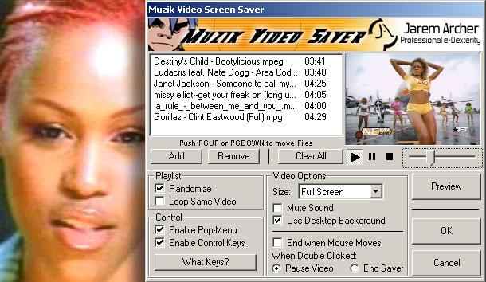



## Muzik Video Saver \- Play your Music Videos as a Screen Saver\!\!

### Description

Play your music videos as a screen saver!! My friend told me to make it so I did for his collection of music videos and now I'm using it myself. Its a pretty neat program even if you dont have videos. Please Vote and tell me what to change/add.
 
### More Info
 

             |
---                |---
**Submitted On**   |2001-08-03 20:30:54
**By**             |[Jarem Archer](https://github.com/Planet-Source-Code/PSCIndex/blob/master/ByAuthor/jarem-archer.md)
**Level**          |Intermediate
**User Rating**    |5.0 (35 globes from 7 users)
**Compatibility**  |VB 5\.0, VB 6\.0
**Category**       |[Complete Applications](https://github.com/Planet-Source-Code/PSCIndex/blob/master/ByCategory/complete-applications__1-27.md)
**World**          |[Visual Basic](https://github.com/Planet-Source-Code/PSCIndex/blob/master/ByWorld/visual-basic.md)
**Archive File**   |[Muzik Vide24044832001\.zip](https://github.com/Planet-Source-Code/jarem-archer-muzik-video-saver-play-your-music-videos-as-a-screen-saver__1-25835/archive/master.zip)

